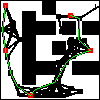

# PathPlanning
When discussing robot path planning algorithms, there are two basic techniques that are used as a starting point: **Probablistic Road Map (PRM)**, and **Rapidly exploring Random Trees (RRT)**.

Of course there  are other techniques, but I enjoy these two methods especially, since they were easy to understand, and personally help me understand graohs a lot better.

My hope with this repository is that the reader also may be able to explore how these algorithms work, and see them in action.

As a prologue, here are the two algorithms in action:

PRM, after it used A* to find the shortest path:

RRT, going from start to end by visiting each waypoints:

![][rrt]

[rrt]: images/total.gif

## Repository Information
The map, represented by this [file](images/sim_map.png). The white spaces represent areas that are available/empty,
and black spaces represent areas with obstacle on it. In a real life scenario, this map would based on probability, 
where each grid represents the probability of it being empty. This is a toy project about path planning, therefore the mapping itself is not the focus.

## PRM
Probablistic Road Map randomly samples a point, and marks it as a valid vertex if that grid is empty. 
If that space is occupied with obstacle, then another point is sampled.

After n samples are collected, each vertex finds nearest neighbours that does not have a collision between them.
Once the neighbours of each vertices are identified, a graph is formed by connecting these points.

Then, the shortest distance is identified for traversal.

Please check [this lecture note from Columbia university](http://www.cs.columbia.edu/~allen/F15/NOTES/Probabilisticpath.pdf) for more details.

## RRT
Rapidly Expanding Random Trees work by expanding a tree from starting point and end point, and joining them once they are close enough.
The tree expands py randomly sampling a point, and expanding the graph **towards** that random point, by taking a step for a give size.
The graph is connected once it is confirmed that there is no obstacle present between the graph, and new point.

Please check [this lecture note from CMU](https://www.cs.cmu.edu/~motionplanning/lecture/lec20.pdf) for more details.

